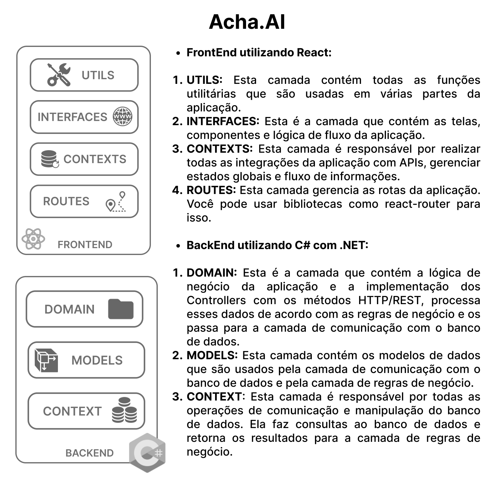
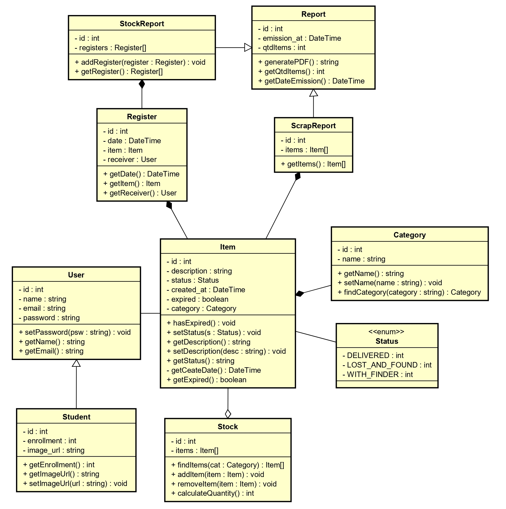

# Ache AI - Sistema de Monitoramento de Notificações de Achados e Perdidos

## Equipe
- Francisco Vitor Gomes Castro (536246)
- Guilherme Lima Moretti (536179)
- Kalmax dos Santos Sousa (537794)
- Nicolas Martins de Sousa (539167)
- Sarah Lisley Saraiva Soares (537556)

## Descrição do Projeto
O Ache AI é um sistema desenvolvido para gerenciar o setor de achados e perdidos da Universidade Federal do Ceará (UFC) - Campus Quixadá. Este sistema visa automatizar e otimizar o processo de registro e recuperação de itens perdidos dentro do campus, proporcionando praticidade e eficiência tanto para os usuários quanto para os administradores.

## Problema
Atualmente, o gerenciamento de itens perdidos no campus é feito manualmente, o que gera inconveniência e maior carga de trabalho para os funcionários, além de dificultar a recuperação de objetos pelos proprietários.

## Solução
O Ache AI oferece uma solução digital que permite:
- **Registro de Itens:** Permite que usuários registrem itens perdidos ou encontrados de forma rápida e fácil.
- **Notificações:** Sistema de notificação em tempo real para informar usuários sobre itens perdidos ou encontrados.
- **Autenticação:** Integração com a identidade institucional da UFC-Quixadá para autenticação dos usuários.
- **Relatórios:** Geração de relatórios e estatísticas sobre itens perdidos e encontrados.
- **Busca de Itens:** Pesquisa por itens perdidos através de filtros como categoria e data de perda.

## Requisitos do Sistema
### Funcionais
- **Registro de Itens:** Cadastrar itens perdidos e encontrados.
- **Notificações:** Notificar usuários sobre registros de itens.
- **Busca:** Permitir pesquisa por itens perdidos através de filtros.
- **Autenticação:** Integrar com o sistema de identidade da UFC-Quixadá.
- **Relatórios:** Gerar relatórios periódicos.

### Não Funcionais
- **Usabilidade:** Interface amigável e fácil de usar.
- **Segurança:** Proteção de dados pessoais e prevenção de acessos não autorizados.
- **Desempenho:** Sistema responsivo e eficiente.

## Arquitetura do Projeto

PS.: Durante Sessões colaborativas com a equipe, foi deliberada a alteração da arquitetura do sistema. As tecnologias do backend foram repensadas para o Node.js com Express. Imagem sofrerá alteração posteriormente.

## Tecnologias Utilizadas
- **React** para o front-end.
- **Node.js com Express** para o back-end.
- **Sequelize** como ORM para interação com o **PostgreSQL**.
- **Figma** para design de interface.

## Diagrama de Classes

